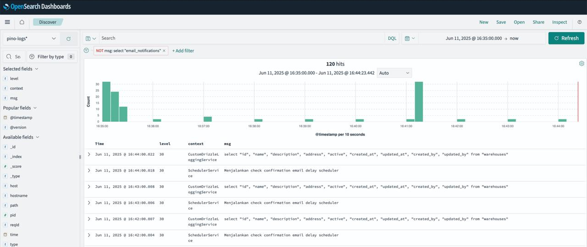

# OpenSearch Log Analysis Stack



This project sets up a complete log analysis stack using OpenSearch, OpenSearch Dashboards, and Logstash. It's designed to collect, process, and visualize JSON logs.

## Prerequisites

- Docker
- Docker Compose

## Installation

1. Clone this repository:

   ```bash
   git clone <repository-url>
   cd logstash-search
   ```

2. Create environment file:

   ```bash
   cp .env.example .env
   ```

3. Create a logs directory:

   ```bash
   mkdir logs
   ```

4. Create a symlink to the logs directory:

   ```bash
   ln -s /<YOUR_LOGS_PATH>/logs logs
   ```

5. Configure the environment variables in `.env`:
   - Set `LOGSTASH_INPUT_PATH` to the path of your log files
   - Set `LOGSTASH_OUTPUT_INDEX` to the name of your index
   - Set a strong password for `OPENSEARCH_INITIAL_ADMIN_PASSWORD`
   - Adjust Java memory settings if needed (`OPENSEARCH_JAVA_OPTS`, `LS_JAVA_OPTS`)
   - Set `PLUGINS_SECURITY_DISABLED=true` for development
   - Set `DISABLE_SECURITY_DASHBOARDS_PLUGIN=true` for development

6. Start the services:

   ```bash
   docker-compose up -d
   ```

## Configuration Indexing Pattern

1. Open OpenSearch Dashboards at [http://localhost:5601](http://localhost:5601)
2. Go to Management > Dashboard Management > Index Patterns > Click Create Index Pattern
3. Fill `<your-index-name>-logs-*` as the index pattern name
4. Click on Create index pattern
5. Select `@timestamp` as the time field
6. Click on Create index pattern
7. Back to Discover page
8. You should see your logs indexed in the Discover page

## Import Dashboard Template

1. Open OpenSearch Dashboards at [http://localhost:5601](http://localhost:5601)
2. Go to Management > Dashboard Management > Import Dashboard
3. Click on Import
4. Select `dashboard-template.ndjson` file
5. Select your `<your-index-name>-logs-*` as the index pattern name
6. Click on Import
7. Back to Dashboard page
8. You should see your dashboard in the Dashboard page

## Services

- **OpenSearch**: Running on [http://localhost:9200](http://localhost:9200)
  - Search engine and document store
  - Manages data indexing and search operations

- **OpenSearch Dashboards**: Running on [http://localhost:5601](http://localhost:5601)
  - Web interface for data visualization
  - Create custom dashboards and visualizations

- **Logstash**:
  - Monitors the `logs` directory for JSON log files
  - Processes logs matching pattern `log.*.log`
  - Forwards processed logs to OpenSearch

## Log Format

Logstash expects JSON-formatted logs with a `time` field in UNIX milliseconds. Example:

```json
{
  "time": 1623456789000,
  "level": 30,
  "msg": "Sample log message",
  "context": "ClassService"
}
```

## Security

By default, security plugins are disabled for development. For production:

1. Set `PLUGINS_SECURITY_DISABLED=false` in `.env`
2. Set `DISABLE_SECURITY_DASHBOARDS_PLUGIN=false` in `.env`
3. Configure proper authentication and SSL/TLS

## Data Persistence

OpenSearch data is persisted in a Docker volume named `osdata`.

## Stopping the Stack

To stop all services:

```bash
docker-compose down
```

To stop and remove all data:

```bash
docker-compose down -v
```

## Storage Analysis

The following is a summary of the storage usage of the container:

1. Container Sizes (actual/virtual):
   - OpenSearch: 635kB (virtual 1.09GB)
   - OpenSearch Dashboards: 257kB (virtual 1.6GB)
   - Logstash: 367kB (virtual 1.77GB)
   - Filebeat: 213kB (virtual 264MB)

2. Volume:
   - OpenSearch Data (logstash-search_osdata): 28.41MB

**The total storage usage is:**

- Container actual size: ~1.47MB
- Container virtual size: ~4.72GB
- Volume size: 28.41MB
- Total effective size: ~4.75GB
